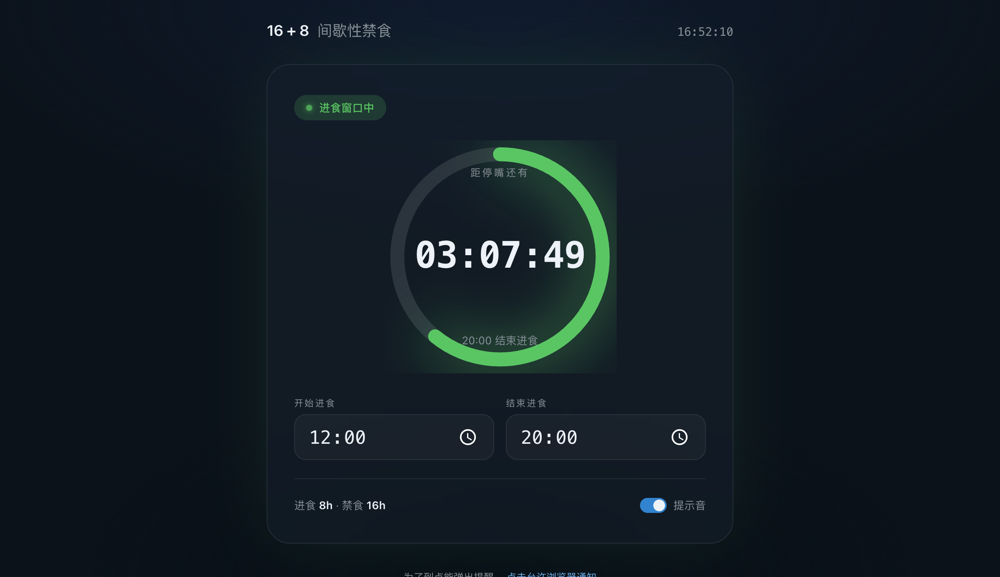
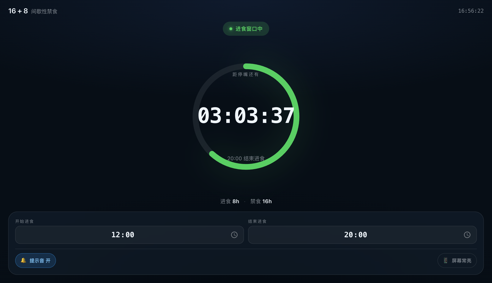

# 16+8 Intermittent Fasting Tracker (16+8 间歇性禁食闹钟)

[](https://opensource.org/licenses/MIT)
[](https://www.python.org/)
[](https://github.com/T1113/16-8-fasting-tracker/stargazers)

A multi-platform 16:8 intermittent fasting tracker and timer. This project provides multiple interfaces for tracking your fasting and eating windows, all sharing a single, unified configuration logic.

这是一个多平台的 16+8 间歇性禁食追踪器与闹钟。本项目提供了多种界面供你记录进食和禁食窗口，且所有界面的设置逻辑互通、无缝同步。

### 🌟 [Live Demo (在线体验)](https://t1113.github.io/16-8-fasting-tracker/mobile.html)
*(Click to use the Mobile Web version immediately / 点击立即体验移动网页版)*

## 💡 Why use this? (为什么选择这个？)

市面上有许多断食软件，但我们与众不同：
- 🚫 **No Ads, No Subscriptions (零广告，零内购)**: Completely free forever. (永久完全免费，没有烦人的弹窗和诱导付费)。
- 🔒 **100% Privacy (绝对隐私)**: No accounts required. All data stays locally on your device. (无需注册账号，所有数据均保存在本地，你的数据只属于你自己)。
- 📱 **Cross-Platform (全平台覆盖)**: From a mobile PWA to a terminal CLI, use it wherever you are. (无论是在手机浏览器、电脑桌面还是终端命令行，都可以无缝使用)。

## 📸 Screenshots (运行截图)

| Desktop Web (`index.html`) | Mobile Web (`mobile.html`) |
|:---:|:---:|
|  |  |

*(Note: GUI and CLI screenshots can be added later / 桌面客户端与命令行版的截图暂略)*

## ✨ Features (功能特性)

- **Cross-Platform Interfaces (跨平台界面)**:
  - **Mobile Web (`mobile.html`)**: Optimized for mobile screens, supports PWA (Add to Home Screen), and includes Wake Lock to keep the screen on. (专为手机屏幕优化，支持 PWA 添加到主屏幕，并提供屏幕常亮功能)
  - **Desktop Web (`index.html`)**: A beautiful, minimalist UI for desktop browsers with visual ring progress. (为桌面浏览器设计的极简美观 UI，提供可视化进度环)
  - **Desktop GUI (`gui.py`)**: A native desktop application built with Python and Tkinter. (基于 Python 和 Tkinter 构建的桌面原生客户端)
  - **Command Line (`cli.py`)**: A lightweight terminal-based tracker. (轻量级的终端命令行追踪器)
- **Unified Configuration (统一配置)**: All versions logic share and sync the same core fasting windows. (各端版本共享同一套核心数据，无缝同步禁食时间窗口)
- **Notifications & Sounds (提醒与音效)**: Real-time reminders when your window changes. (在进食或禁食状态切换时，提供实时的通知与音效提醒)

## 🚀 Usage (使用说明)

### Python CLI & GUI (命令行与桌面端)

Ensure you have Python 3 installed. No external dependencies are required.
请确保你已安装 Python 3，无需安装任何第三方依赖。

```bash
# Run the Desktop GUI (运行桌面客户端)
python3 gui.py

# Run the CLI (运行命令行版)
python3 cli.py
```

### Web Versions (网页端)

Simply open the HTML files in your browser. 
For the best mobile experience, host `mobile.html` on a web server or open it directly on your device, and add it to your home screen.

直接在浏览器中打开 HTML 文件即可使用。
如果想获得最佳的手机端体验，请将 `mobile.html` 部署到服务器或直接在手机浏览器中打开，然后选择“添加到主屏幕(Add to Home Screen)”。

## 🤝 Contributing (参与贡献)

Contributions are welcome! Feel free to open issues or submit pull requests to improve the UI, add new features (e.g., stats, history tracking), or build interfaces for other platforms.

欢迎贡献！无论是提交 Issue 反馈问题，还是提交 PR 来改善 UI、增加新功能（例如统计图表、历史记录打卡等）或是开发新平台的版本，我们都非常期待你的加入。

## 📄 License (开源协议)

MIT License
